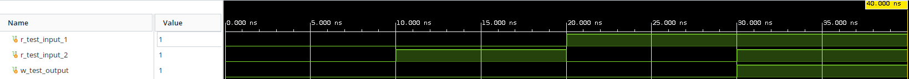
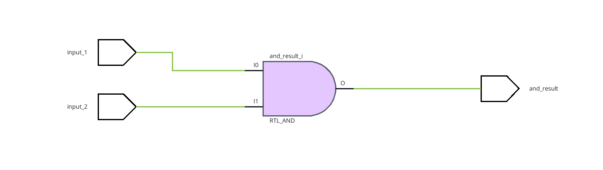
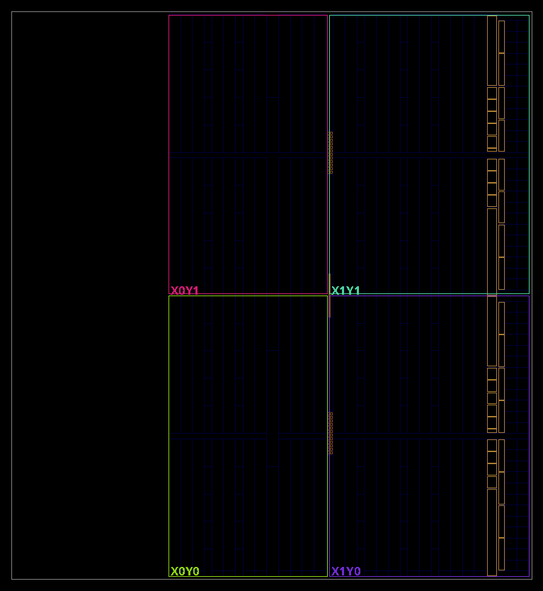
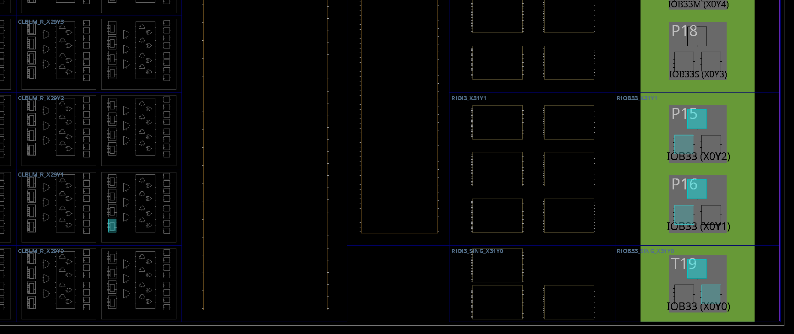

# FPGA-101
Simple code examples in VHDL for FPGA development.
Dedicated code creates look-up tables for doing the corresponding boolean algebra (i.e., logic gates **do not** physicsally exist inside the FPGA).
Together with flip-flops (to keep information about the machine state), the FPGA's magic becomes possible.
The data is stored inside embedded block RAM.

## FPGA Model

Zunq-7000 &s CLG400 FPGA on a Digilent Zora z7s Zynq development board.

## Timing 

Precise timing is important for sequential (that is, driven by a clock) logic.
E.g., propagation of a signal between two consequent flip-flops cannot be longer than 1 clock period.
Adding more logic between two elements results in a longer signal propagation delay, 
so the logic should be broken up into smaller stages - **pipelines**.

The minimal clock cycle period (equivalently, the maximum clock frequency) is defined by the summ of several components:

1. *setup time*: for how long the flip-flop's input must be stable **before** the rising edge of the clock in order to be registered correctly;

2. *hold time*: for how long the flip-flop's input must be stable **after** the rising edge of the clock in order to be registered correctly;

3. *propagation delay*: how long it takes the signal to move from the source to the destination. 

The former two are fixed by the design of the flip-flops, only the latter can be controlled. Adding more logic between two elements results in a 
longer signal propagation delay, so the logic should be broken up into smaller stages - **pipelines**.

Another option is slowing down the clock to allow more time between clock cycles for the signal to propagate.


Failing to properly meet timing requirements will result in flip-flops possibly entering a *metastable* state.
The FPGA will then not operate in the intended way.
A situtation where a metastable state is possible can be fixed by cascading the data through 2 consequent flip-flops.

### Crossing Clock Domains

It is possible to use several clocks inside a single FPGA design. Even if they have the same frequency, there is no way to ensure that 
the clocks are synchronous since they might have started at different moments in time, let alone when different clocks have different frequencies.

Such a situation is refered to as *crossing clock domains*. 

> [!WARNING]
> Crossing clock domains may produce flip-flops in a metastable state, therefore one must ensure a safe domain crossing!

Going from a slower to a faster clock requires passing the data through two chained flip-flops when data is transmitted
to the faster clock: even if the first flip-slop enters a metastable state, the second one will almost certainly have a steady
output:

```Verilog
always @(posedge i_faster_clock)
begin
    r_buffer_data <= i_slow_data;
    o_fast_data <= r_buffer_data;
end
```
Going from a faster clock to a slower one poses more challenges since the faster data may change quicker than the slow clock will 
"sample" it, resulting in data loss. One possible approach is to stretch the waveform in the faster domain in such a way that the slower
clock will be sure to capture it. 

> [!TIP]
> Stretch the fast data to at least two slow clock cycles. In that way the data is certainly stable by the end of the second clock cycle.

## Defining Constraints

To map inputs and outputs in the code to physical pins on the board, one must use a constraints file (*.xdc* extension).

First one defines the clock. The following example maps the physical pin (pin *H16*, can be found in the board schematics)
to a Verilog variable *i_clock*, then defines a system clock with a given period (in ns) and rise and fall times of the square signal (here at 0 and 5 ns, respectively):

```txt
set_property -dict { PACKAGE_PIN H16   IOSTANDARD LVCMOS33 } [get_ports { i_clock }];
create_clock -add -name sys_clk_pin -period 10.00 -waveform {0 5} [get_ports { i_clock }];
```

Now the variable *i_clock* can be used inside the code. Similar code (first line, but with a different pin and variable name).

The constaints master file for most commmon boards can be found at [the Digilent GitHub](https://github.com/Digilent/digilent-xdc).
All pins are already mapped there, just uncomment the required ones.

## SystemVerilog Syntax Fundamentals 

A fundamental unit of code is *logic*, which replaces both a *wire* (no initial value) or a *register* (with an inital value) in Verilog.

All input and output signals are defined inside an **module** block (see **and_gate** example):

```Verilog
module and_gate
    (input logic input_1,
     input logic input_2,
     output logic and_result);
    
    assign and_result = input_1 & input_2;
endmodule
```

Available bit-wise operations include *NOT* (*~*), *AND* (*&*), *OR* (*|*), *XOR* (*^*).

A process can be declared as follows:

```Verilog
always @ (input_1 or input_2) // this sensitivity list defines which signals will cause the block to execute
begin
    and_gate = input_1 & input_2;
end
```

The rising/falling edge of the system clock can be monitored with:

```Verilog
always @ (posedge i_clock) // or negedge
begin
...
    and_gate <= input_1 & input_2;
end
```

> [!NOTE]
> Combinational assignments should use = (blocking - executed immediately), while sequential assignments should use <= (non-blocking - executed at next cycle)

Constant values should be prefixed with *c_*.

The SystemVerilog code will be translated into some logical elements with the help of a *synthesis tool*.

## Simulating The Design

To simulate a design, test inputs are provided via a **testbench** - code that checks which outputs are triggered for given inputs.
For a testbench, there are no input or output signals to be defined since all signals are generated internally. 
Simulated signals are displayes as green *waveforms*:



Simulating a design is quite involved and is more difficult than the design itself, but SystemVerilog is equipped with many tools for it. A lot of useful information can he found [on the ChipVerify website](https://chipverify.com/systemverilog/systemverilog-assertions).

## Linter

In the linting stage, the code will is translated to logical schematics. The design suite will check that all design rules are obeyed.

The schematics will contain a list of:

- *cells* (elements performing functions);
- *I/O Ports*;
- *nets* (lines connecting cells and ports).



This allows checking that the design suite understood correctly what the intention of the program was.

## Synthesis And Implementation

Initially, **synthesis** converts the VHDL/Verilog code into a series of primitive components: flip-flops and logic gates.
To make best use of the FPGA's limited resources, the synthesis tools will perform *logic optimization*.
Trying to synthesize a design that uses more resources than the FPGA has at its disposal will yield a **utilization error**.

At this stage, the device floorplan view becomes available. It show the device's features, e.g. division into clock regions (here 4 of them: X\*Y\*):



> [!TIP]
> Use no more than 80% of the avaiable resources to make the subsequent stages easier.

These elements are then mapped to physical components inside the FPGA during the **implementation**, or **place-and-route**, phase. Now the device's 
floorplan shows what components were used and where theywere placed:



In the implementation phase, the tools will test the synthesized design under all forseen (including worst-case scenario) operating conditions.
If the design will work correctly in all such scenarios given the defined clock frequency, the design is said to meet the timing requirements.


Finally, the **bistream** process generates a *.bit* file that can be uploaded to the FPGA.

## Programming The Device

The generated bitsream can be uploaded to the FPGA board using a hardware manager. IDEs may already include that. Choose the *.bit* file 
and upload it to the board.

## Sources

Have a look at [NANDland](https://nandland.com/) and the [brilliant book](https://nostarch.com/gettingstartedwithfpgas) by Russel Merrick, both list the syntax basics for Verilog and VHDL and a number of useful examples.
The book is accompanied by a dedicated [GitHub repository](https://github.com/nandland/getting-started-with-fpgas).
